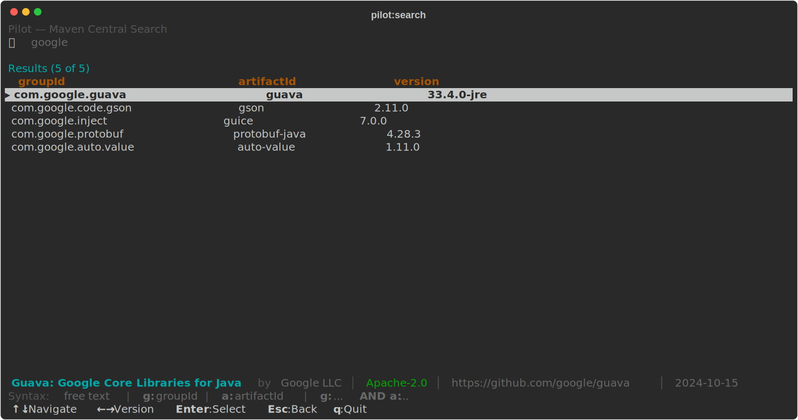
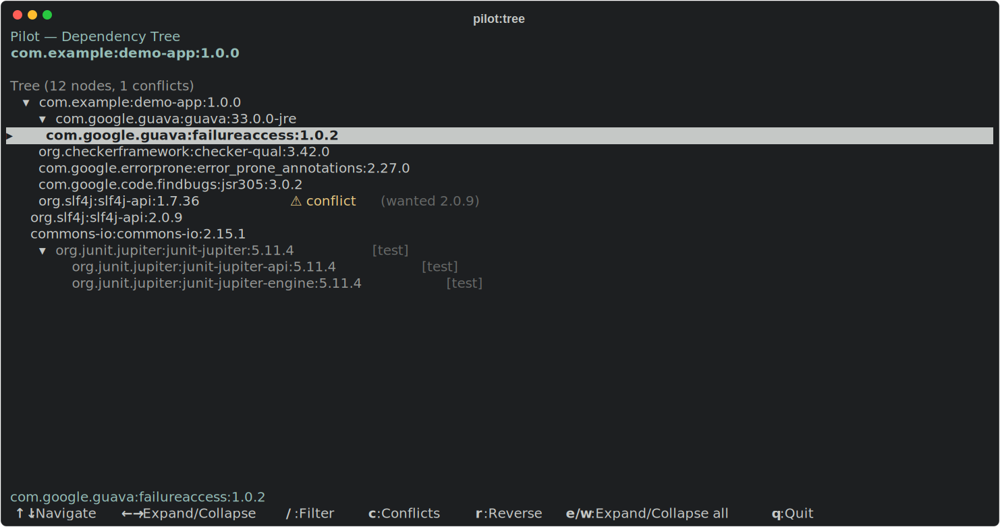
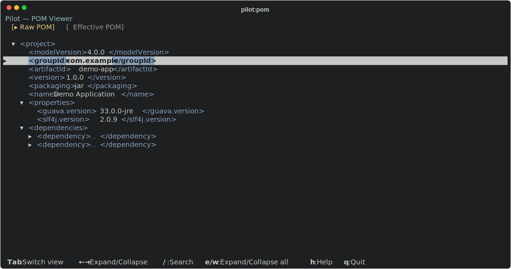
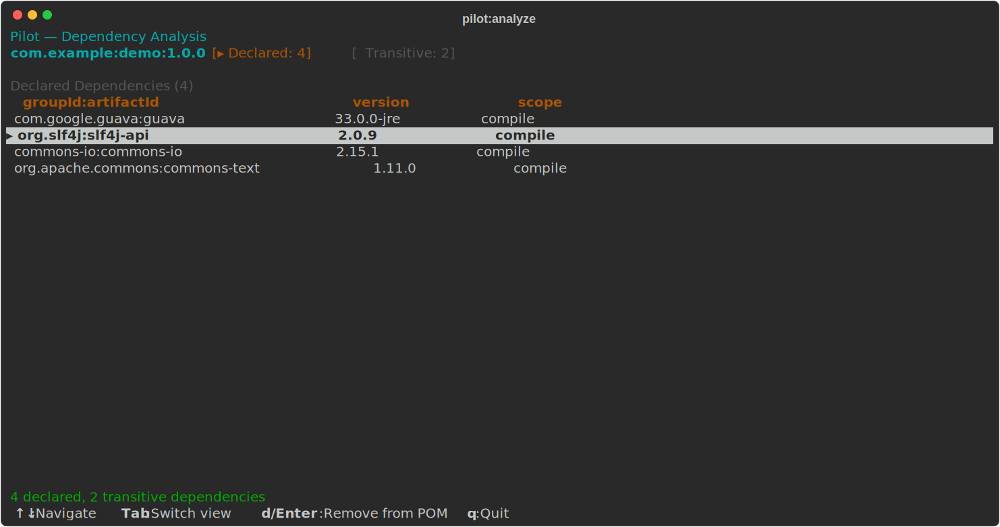
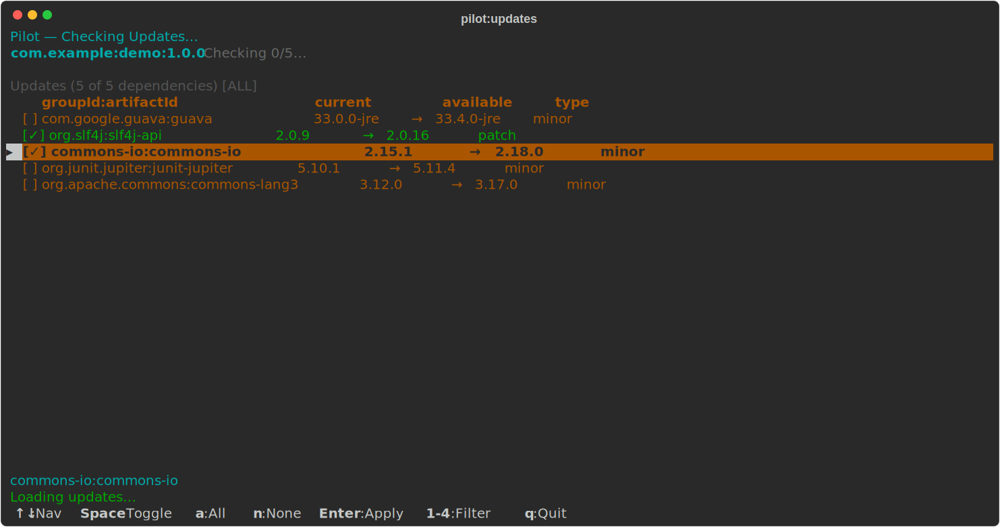
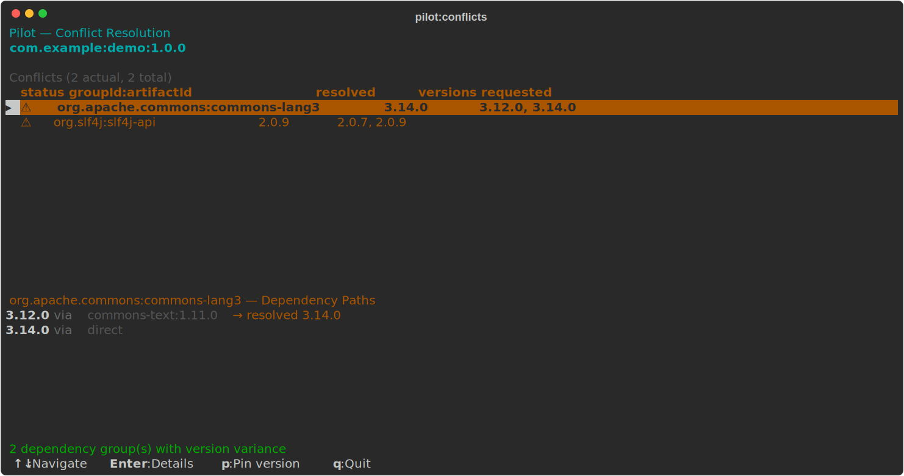
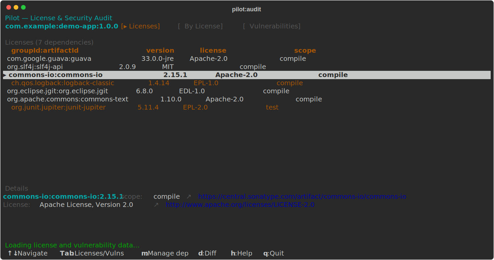
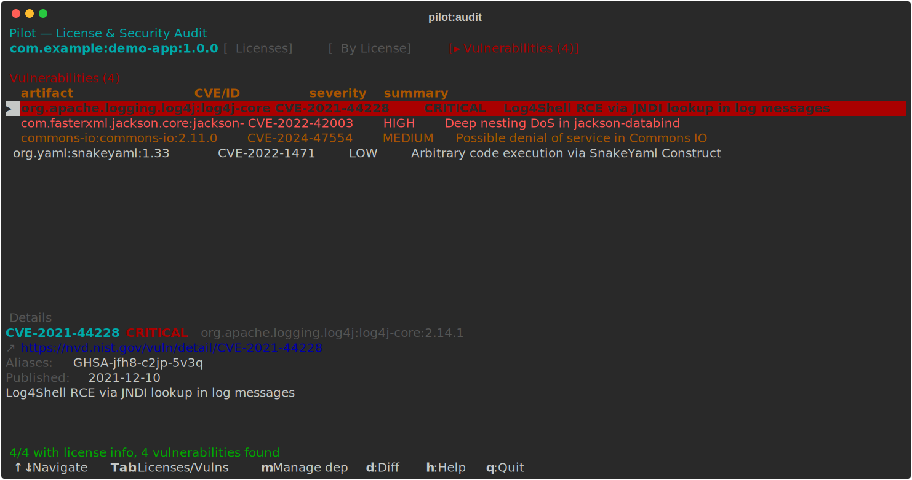
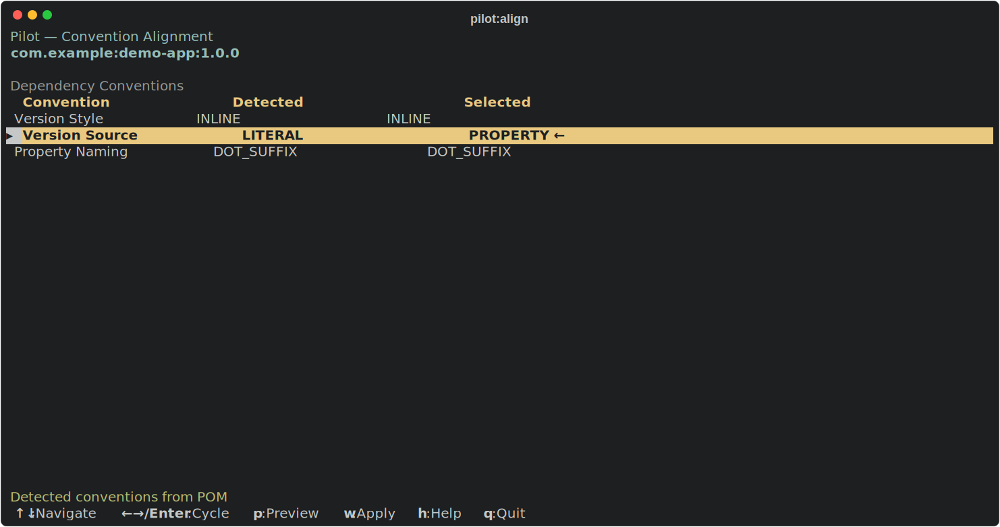

# Pilot

**Interactive TUI for Maven** -- search, browse, and manage dependencies from the terminal.

Pilot is a Maven plugin (and standalone CLI) that replaces hard-to-read CLI output with interactive, keyboard-driven terminal interfaces. Navigate dependency trees, check for updates, resolve conflicts, and edit your POM -- all without leaving the terminal.

## Goals

| Goal | Description |
|------|-------------|
| `pilot:pilot` | Interactive launcher -- pick a module and tool from the TUI (recommended entry point) |
| `pilot:search` | Search Maven Central interactively with async results and version cycling |
| `pilot:tree` | Browse the resolved dependency tree with expand/collapse, conflict highlighting, scope filtering, and reverse path lookup |
| `pilot:pom` | View raw and effective POM with syntax highlighting, collapsible XML nodes, and origin tracking |
| `pilot:dependencies` | Bytecode-level analysis of declared vs used dependencies with ASM, SPI detection, and member-level references |
| `pilot:updates` | Check for dependency updates with patch/minor/major classification and batch POM editing |
| `pilot:conflicts` | Detect version conflicts across the dependency tree and pin versions via `dependencyManagement` |
| `pilot:audit` | License overview and CVE lookup (via OSV.dev) for all transitive dependencies |
| `pilot:align` | Detect and align dependency conventions (version style, property naming) across POMs |

## Quick Start

### As a Maven plugin

> **Tip:** To use the short `mvn pilot:tree` syntax instead of the full `mvn eu.maveniverse.maven.plugins:pilot:tree`, add the plugin group to your `~/.m2/settings.xml`:
> ```xml
> <pluginGroups>
>   <pluginGroup>eu.maveniverse.maven.plugins</pluginGroup>
> </pluginGroups>
> ```

```bash
# Launch the interactive pilot (recommended)
mvn pilot:pilot

# Search Maven Central
mvn pilot:search

# Browse the dependency tree
mvn pilot:tree

# Check for dependency updates
mvn pilot:updates

# View POM with syntax highlighting
mvn pilot:pom

# Analyze dependency usage (run 'mvn compile' first for bytecode analysis)
mvn compile pilot:dependencies

# Detect and resolve version conflicts
mvn pilot:conflicts

# License and vulnerability audit
mvn pilot:audit

# Align dependency conventions
mvn pilot:align
```

### Standalone CLI

Pilot also ships as a standalone executable that works without a Maven build. The quickest way to try it is with [JBang](https://www.jbang.dev/):

```bash
jbang pilot@maveniverse/pilot              # uses ./pom.xml
jbang pilot@maveniverse/pilot path/to/pom.xml
```

Or run the JAR directly:

```bash
java -jar pilot-cli.jar              # uses ./pom.xml
java -jar pilot-cli.jar path/to/pom.xml
```

The CLI embeds a Maven 4 resolver, so it resolves dependencies, builds the reactor tree, and launches the same unified shell -- no `mvn` required.

## Multi-Module Reactor Support

In multi-module builds, Pilot automatically detects the reactor and shows a **module tree** in a persistent left panel, mirroring the Maven reactor hierarchy. Select a module from the tree, then switch between tools using the tab bar -- your module selection is preserved across tool switches.

Some tools operate reactor-wide (updates, conflicts, audit), analyzing all modules at once. Others are per-module (tree, dependencies, pom). When selecting a parent/aggregator module, tools that don't apply (e.g., bytecode analysis) are filtered out. For **align**, selecting a parent module automatically aligns all child modules in one go.

## Features

### Pilot Launcher (`pilot:pilot`)

The main entry point. Opens a unified IDE-like shell with a persistent module tree on the left and tool tabs across the top. Select a module from the tree, then switch between tools using tabs or `Alt+letter` shortcuts. In single-module projects the tree is hidden and tools are shown directly. A slide-up help panel (`h`) shows contextual keyboard shortcuts for the active tool.

### Search (`pilot:search`)

Type to search Maven Central. Results load asynchronously with pagination. Use `Left`/`Right` arrows to cycle through available versions. Bottom bar shows POM metadata (name, license, organization, date).

[](https://maveniverse.github.io/pilot/player/search.html)

**Keys:** `Enter` -- focus results, `Left`/`Right` -- cycle versions, `Esc` -- back to search, `q` -- quit

### Dependency Tree (`pilot:tree`)

Interactive collapsible tree view of all resolved dependencies. Conflicts are highlighted with markers. Filter by name, jump between conflicts, and trace any dependency back to the root with reverse path mode. Toggle scope (`s`) to cycle between compile, runtime, and test views.

[](https://maveniverse.github.io/pilot/player/dependency-tree.html)

**Keys:** `<>` -- expand/collapse, `jk` -- navigate, `/` -- filter, `c` -- next conflict, `r` -- reverse path, `s` -- cycle scope, `e/w` -- expand/collapse all, `PgUp/PgDn/Home/End` -- page navigation

### POM Viewer (`pilot:pom`)

Syntax-highlighted XML viewer with two switchable modes: **Raw POM** shows your `pom.xml` as-is, **Effective POM** shows the fully resolved model with origin annotations. When a line has a known origin, a detail pane shows the relevant source lines from the parent POM.

[](https://maveniverse.github.io/pilot/player/pom-viewer.html)

**Keys:** `Tab` -- switch Raw/Effective, `<>` -- expand/collapse, `/` -- search, `n/N` -- next/prev match, `e/w` -- expand/collapse all

### Dependency Analysis (`pilot:dependencies`)

Two views: **Declared** dependencies and **Transitive** dependencies. Uses ASM bytecode analysis to determine which dependencies are actually referenced in code, with member-level detail (method calls, field accesses). Detects SPI/ServiceLoader usage -- dependencies providing `META-INF/services` are recognized even without direct class references.

Each dependency is marked with a usage indicator: `✓` for used, `✗` for unused. Tab headers show counts (e.g., `Declared: 4 (2 unused)`). A details pane shows per-class member references and SPI service interfaces. Promote transitive dependencies to declared, remove unused ones, or change scope -- all with single keypresses that edit your POM via DomTrip.

Run `mvn compile` before this goal for full bytecode analysis. A warning banner appears when classes are not compiled.

[](https://maveniverse.github.io/pilot/player/dependencies.html)

**Keys:** `Tab` -- switch Declared/Transitive, `x` -- remove declared, `a` -- add transitive, `s` -- change scope, `d` -- show diff, `h` -- help

### Dependency Updates (`pilot:updates`)

Scans all dependencies for newer versions. Updates are color-coded: green (patch), yellow (minor), red (major). Select individually or batch-select, then apply -- Pilot edits your POM directly using lossless XML editing that preserves formatting and comments. In reactor builds, shows a reactor-wide view with per-module breakdown.

[](https://maveniverse.github.io/pilot/player/updates.html)

**Keys:** `Space` -- toggle, `a` -- select all, `n` -- deselect all, `Enter` -- apply, `1-4` -- filter by type

### Conflict Resolution (`pilot:conflicts`)

Groups dependencies by `groupId:artifactId` and shows where different versions are requested. Toggle between actual conflicts only or all dependency groups (`a`). Expand any conflict to see the full dependency paths. Pin a version to `dependencyManagement` with one keypress.

[](https://maveniverse.github.io/pilot/player/conflicts.html)

**Keys:** `Enter/Space` -- toggle details, `p` -- pin version, `a` -- toggle show all, `jk` -- navigate

### License & Security Audit (`pilot:audit`)

Three views: **Licenses** shows all transitive dependencies with their licenses (color-coded by permissiveness), **By License** groups dependencies under each license type, and **Vulnerabilities** queries OSV.dev for known CVEs with severity-coded rows (CRITICAL/HIGH/MEDIUM/LOW). Data loads asynchronously. Filter by scope (`s`) to focus on compile, runtime, or test dependencies. In reactor builds, tracks which modules use each dependency.

[](https://maveniverse.github.io/pilot/player/audit.html)

[](https://maveniverse.github.io/pilot/player/audit.html)

**Keys:** `Tab` -- switch view, `s` -- cycle scope filter, `m` -- manage dependency, `d` -- show diff, `h` -- help

### Convention Alignment (`pilot:align`)

Detects the project's current dependency conventions (inline vs managed versions, literal vs property references, property naming patterns) and lets you choose a target convention. Preview the diff before applying. In reactor builds, understands the parent POM hierarchy -- managed dependencies are written to the correct parent POM while child modules get version-less references. Selecting a parent module automatically applies alignment across all child modules in one go.



**Keys:** `jk` -- navigate options, `<>/Enter` -- cycle values, `p` -- preview diff, `w` -- apply, `h` -- help

## How POM Editing Works

Pilot uses [DomTrip](https://maveniverse.github.io/domtrip) for all POM modifications. DomTrip is a lossless XML editor that preserves your formatting, comments, whitespace, and element ordering. When Pilot adds, removes, or updates a dependency, the rest of your POM stays exactly as you wrote it.

## Requirements

- **Maven** 3.6.3+
- **Java** 17+
- A terminal that supports ANSI escape codes (most modern terminals)

## Building

```bash
./mvnw install
```

The project is a multi-module Maven build:

| Module | Description |
|--------|-------------|
| `pilot-core` | Shared TUI views and engine (no Maven dependency) |
| `pilot-plugin` | Maven plugin wrapping the core (Maven 3.x) |
| `pilot-cli` | Standalone shaded JAR with embedded Maven 4 resolver |

## Technology

- **[TamboUI](https://tamboui.dev)** -- Terminal UI framework (Rust Ratatui-inspired, Java-native)
- **[DomTrip](https://maveniverse.github.io/domtrip)** -- Lossless XML/POM editor
- **[ASM](https://asm.ow2.io/)** -- Bytecode analysis for dependency usage detection
- **Maven Plugin API** -- Standard Maven plugin infrastructure
- **OSV.dev** -- Open Source Vulnerability database for security auditing

## License

[Apache License 2.0](LICENSE)
