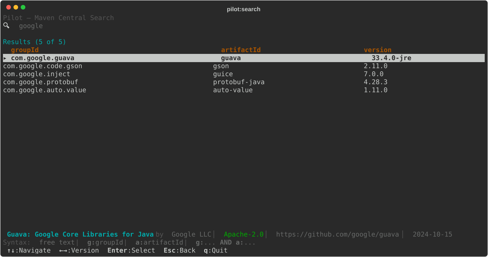
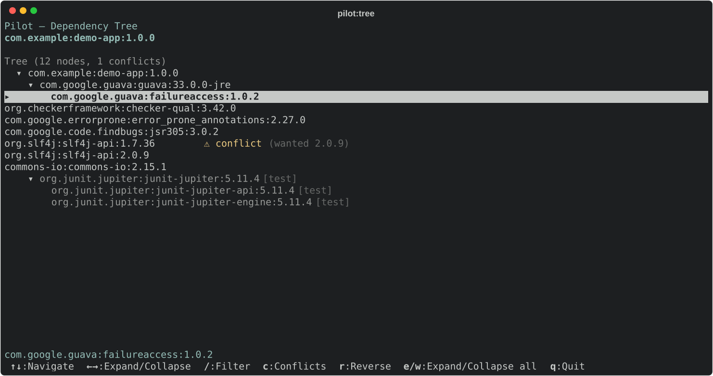
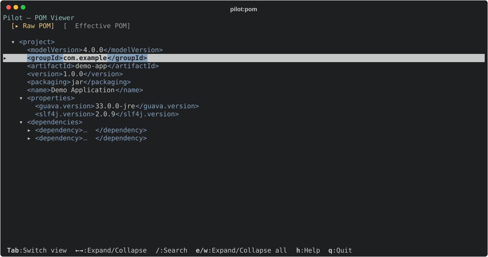
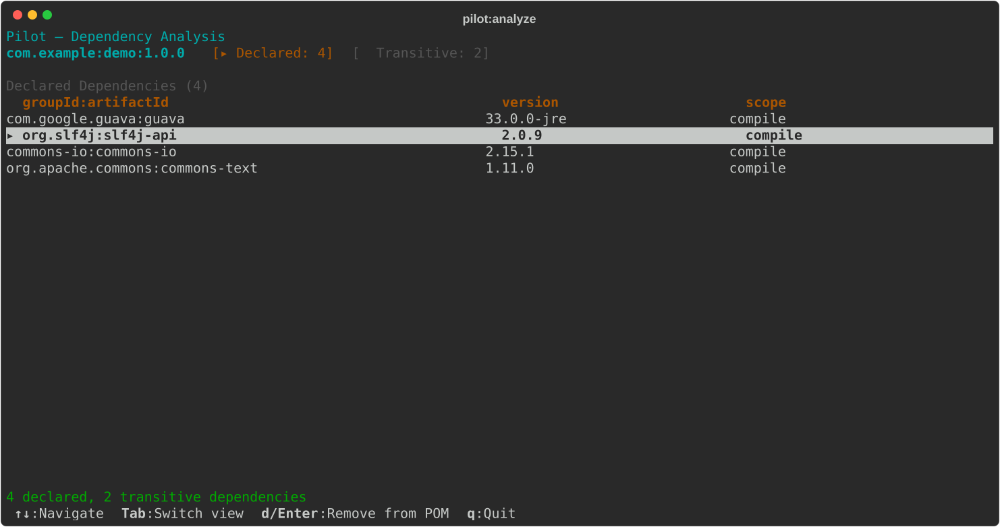
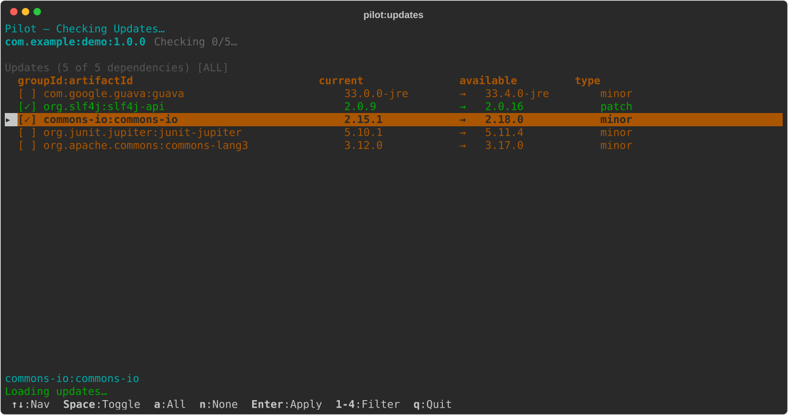
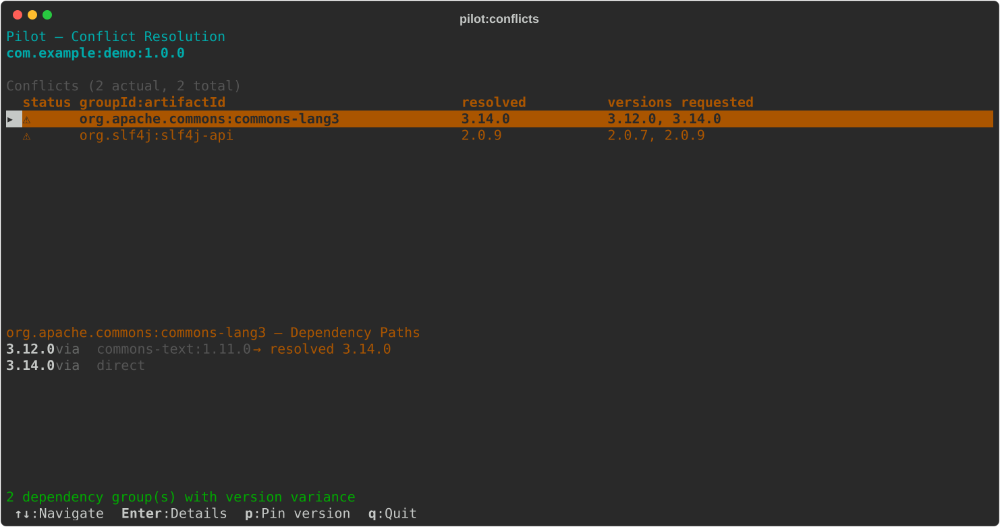
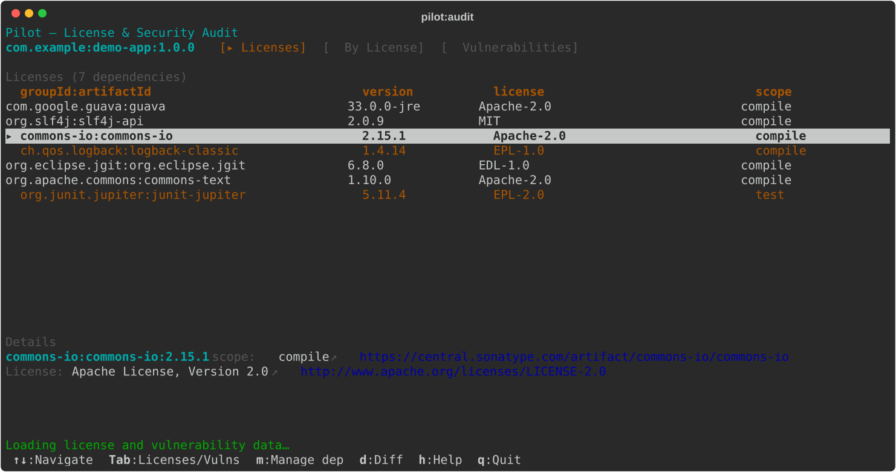
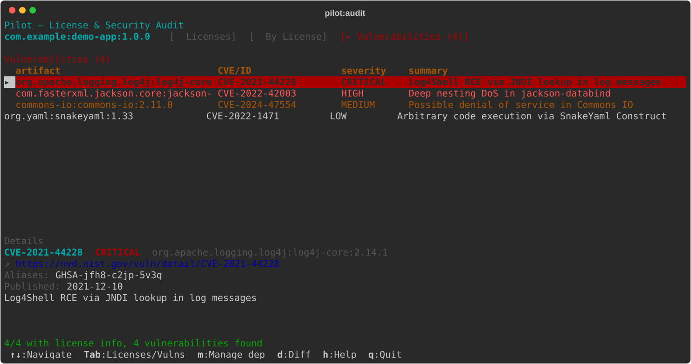
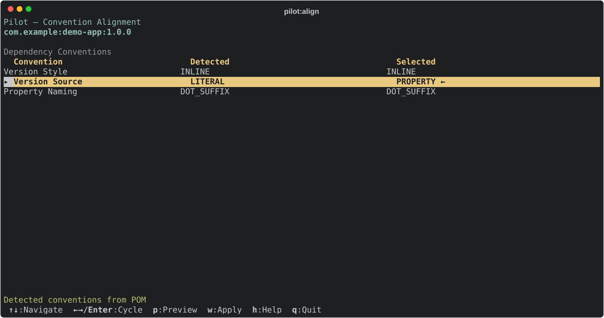

# Pilot

**Interactive TUI for Maven** -- search, browse, and manage dependencies from the terminal.

Pilot is a Maven plugin (and standalone CLI) that replaces hard-to-read CLI output with interactive, keyboard-driven terminal interfaces. Navigate dependency trees, check for updates, resolve conflicts, and edit your POM -- all without leaving the terminal.

## Goals

| Goal | Description |
|------|-------------|
| `pilot:pilot` | Interactive launcher -- pick a module and tool from the TUI (recommended entry point) |
| `pilot:search` | Search Maven Central interactively with async results and version cycling |
| `pilot:tree` | Browse the resolved dependency tree with expand/collapse, conflict highlighting, scope filtering, and reverse path lookup |
| `pilot:pom` | View raw and effective POM with syntax highlighting, collapsible XML nodes, and origin tracking |
| `pilot:dependencies` | Bytecode-level analysis of declared vs used dependencies; supports `report`, `check`, and `fix` actions (interactive TUI via `pilot:pilot`) |
| `pilot:updates` | Check for dependency updates with patch/minor/major classification; supports `report`, `check`, and `fix` actions (interactive TUI via `pilot:pilot`) |
| `pilot:conflicts` | Detect version conflicts across the dependency tree and pin versions via `dependencyManagement`; supports `report` and `check` actions (interactive TUI via `pilot:pilot`) |
| `pilot:audit` | License overview and CVE lookup (via OSV.dev); supports `report` and `check` actions (interactive TUI via `pilot:pilot`) |
| `pilot:align` | Detect and align dependency conventions (version style, property naming) across POMs |
| `pilot:plugins` | Check for plugin version updates in the reactor; supports `report` and `check` actions (TUI browsing available via `pilot:pilot`, `Alt+G`) |
| `pilot:analyze-dependencies` | *(deprecated)* Use `pilot:dependencies -Dpilot.action=check` instead |

## Quick Start

### As a Maven plugin

> **Tip:** To use the short `mvn pilot:tree` syntax instead of the full `mvn eu.maveniverse.maven.plugins:pilot:tree`, add the plugin group to your `~/.m2/settings.xml`:
> ```xml
> <pluginGroups>
>   <pluginGroup>eu.maveniverse.maven.plugins</pluginGroup>
> </pluginGroups>
> ```

```bash
# Launch the interactive pilot (recommended)
mvn pilot:pilot

# Search Maven Central
mvn pilot:search

# Browse the dependency tree
mvn pilot:tree

# Check for dependency updates
mvn pilot:updates

# View POM with syntax highlighting
mvn pilot:pom

# Analyze dependency usage (run 'mvn compile' first for bytecode analysis)
mvn compile pilot:dependencies

# Detect and resolve version conflicts
mvn pilot:conflicts

# License and vulnerability audit
mvn pilot:audit

# Align dependency conventions
mvn pilot:align

# Check plugin updates (headless)
mvn pilot:plugins
mvn pilot:plugins -Dpilot.action=check     # fail build if updates found

# Browse declared and managed plugins interactively (via pilot:pilot, Alt+G)
mvn pilot:pilot

# Non-interactive modes (CI-friendly) — all goals support -Dpilot.action=report|check|fix
mvn compile pilot:dependencies -Dpilot.action=report          # report unused/transitive deps
mvn compile pilot:dependencies -Dpilot.action=check           # fail build on dep issues
mvn compile pilot:dependencies -Dpilot.action=fix             # auto-fix POM

mvn pilot:audit -Dpilot.action=report                         # print CVE + license report
mvn pilot:audit -Dpilot.action=check                          # fail build on HIGH+ CVEs

mvn pilot:updates -Dpilot.action=report                       # print available updates
mvn pilot:updates -Dpilot.action=fix                          # apply all updates to POM
mvn pilot:updates -Dpilot.action=check -Dpilot.updates.libyears=5.0  # fail if too stale
```

### Standalone CLI

Pilot also ships as a standalone executable that works without a Maven build. The quickest way to try it is with [JBang](https://www.jbang.dev/):

```bash
jbang pilot@maveniverse/pilot              # uses ./pom.xml
jbang pilot@maveniverse/pilot path/to/pom.xml
```

Or run the JAR directly:

```bash
java -jar pilot-cli.jar              # uses ./pom.xml
java -jar pilot-cli.jar path/to/pom.xml
```

The CLI embeds a Maven 4 resolver, so it resolves dependencies, builds the reactor tree, and launches the same unified shell -- no `mvn` required.

## Multi-Module Reactor Support

In multi-module builds, Pilot automatically detects the reactor and shows a **module tree** in a persistent left panel, mirroring the Maven reactor hierarchy. Select a module from the tree, then switch between tools using the tab bar -- your module selection is preserved across tool switches.

Some tools operate reactor-wide (updates, conflicts, audit), analyzing all modules at once. Others are per-module (tree, dependencies, pom). When selecting a parent/aggregator module, tools that don't apply (e.g., bytecode analysis) are filtered out. For **align**, selecting a parent module automatically aligns all child modules in one go.

## Features

### Pilot Launcher (`pilot:pilot`)

The main entry point. Opens a unified IDE-like shell with a persistent module tree on the left and tool tabs across the top. Select a module from the tree, then switch between tools using tabs or `Alt+letter` shortcuts. In single-module projects the tree is hidden and tools are shown directly. A slide-up help panel (`h`) shows contextual keyboard shortcuts for the active tool.

[](https://maveniverse.github.io/pilot/player/pilot.html)

**Keys:** `Alt+D/U/C/A/G/P/L/S` -- switch tool, `Tab` -- focus tree/content, `←/→` -- select module, `h` -- help, `q` -- quit

### Search (`pilot:search`)

Type to search Maven Central. Results load asynchronously with pagination. Use `Left`/`Right` arrows to cycle through available versions. Bottom bar shows POM metadata (name, license, organization, date).

[](https://maveniverse.github.io/pilot/player/search.html)

**Keys:** `Enter` -- focus results, `Left`/`Right` -- cycle versions, `Esc` -- back to search, `q` -- quit

### Dependency Tree (`pilot:tree`)

Interactive collapsible tree view of all resolved dependencies. Conflicts are highlighted with markers. Filter by name, jump between conflicts, and trace any dependency back to the root with reverse path mode. Toggle scope (`s`) to cycle between compile, runtime, and test views.

[](https://maveniverse.github.io/pilot/player/dependency-tree.html)

**Keys:** `<>` -- expand/collapse, `jk` -- navigate, `/` -- filter, `c` -- next conflict, `r` -- reverse path, `s` -- cycle scope, `e/w` -- expand/collapse all, `PgUp/PgDn/Home/End` -- page navigation

### POM Viewer (`pilot:pom`)

Syntax-highlighted XML viewer with two switchable modes: **Raw POM** shows your `pom.xml` as-is, **Effective POM** shows the fully resolved model with origin annotations. When a line has a known origin, a detail pane shows the relevant source lines from the parent POM.

[](https://maveniverse.github.io/pilot/player/pom-viewer.html)

**Keys:** `Tab` -- switch Raw/Effective, `<>` -- expand/collapse, `/` -- search, `n/N` -- next/prev match, `e/w` -- expand/collapse all

### Dependency Analysis (`pilot:dependencies`)

Up to five views depending on what was built and how: **Tree** (full resolved dependency tree, same as `pilot:tree`), **Declared** (dependencies in the POM), **Transitive** (all transitive dependencies), **Managed** (entries in `<dependencyManagement>`), and **DM Tree** (transitive tree of managed dependencies). Use digit keys `1`–`5` to switch views (available views adapt based on reactor context).

Uses ASM bytecode analysis to determine which dependencies are actually referenced in code, with member-level detail (method calls, field accesses). Detects SPI/ServiceLoader usage -- dependencies providing `META-INF/services` are recognized even without direct class references.

Each dependency is marked with a usage indicator: `✓` for used, `✗` for unused. Tab headers show counts (e.g., `Declared: 4 (2 unused)`). A details pane shows per-class member references and SPI service interfaces. Promote transitive dependencies to declared, remove unused ones, or change scope -- all with single keypresses that edit your POM via DomTrip.

Run `mvn compile` before this goal for full bytecode analysis. A warning banner appears when classes are not compiled.

The interactive TUI is available via `pilot:pilot` (select a module, then the **Deps** tab). For CI and build integration, `pilot:dependencies` supports headless modes:

```bash
# Report unused declared and used transitive dependencies (exits 0)
mvn compile pilot:dependencies -Dpilot.action=report

# Fail the build if dependency issues are found
mvn compile pilot:dependencies -Dpilot.action=check

# Auto-fix the POM: remove unused declared, add used transitive
mvn compile pilot:dependencies -Dpilot.action=fix
```

Supports allowlists (`runtimeArtifacts`, `annotationOnlyArtifacts`, `extraUsedClasses`) for false positives from bytecode analysis, and ignore lists (`ignoredUnusedDeclared`, `ignoredUsedTransitive`) for suppressing known findings. All pattern sets support `groupId:artifactId` exact match and `groupId:*` wildcards.

```xml
<plugin>
  <groupId>eu.maveniverse.maven.plugins</groupId>
  <artifactId>pilot-plugin</artifactId>
  <configuration>
    <runtimeArtifacts>
      <runtimeArtifact>org.postgresql:postgresql</runtimeArtifact>
    </runtimeArtifacts>
    <ignoredUsedTransitive>
      <ignoredUsedTransitive>org.slf4j:slf4j-api</ignoredUsedTransitive>
    </ignoredUsedTransitive>
  </configuration>
</plugin>
```

> **Note:** `pilot:analyze-dependencies` is deprecated. Use `pilot:dependencies -Dpilot.action=check` instead.

[](https://maveniverse.github.io/pilot/player/dependencies.html)

**Keys (interactive):** `1`–`5` -- switch views (Tree/Declared/Transitive/Managed/DM Tree), `x` -- remove declared/managed, `a` -- add transitive, `c` -- change scope, `s/S` -- sort, `d` -- show diff, `h` -- help

### Dependency Updates (`pilot:updates`)

Scans all dependencies for newer versions. Updates are color-coded: green (patch), yellow (minor), red (major). Select individually or batch-select, then apply -- Pilot edits your POM directly using lossless XML editing that preserves formatting and comments. In reactor builds, shows a reactor-wide view with per-module breakdown.

The interactive TUI is available via `pilot:pilot` (select a module, then the **Updates** tab). For CI and build integration, `pilot:updates` supports headless modes:

```bash
# Print update report with libyear aging (exits 0)
mvn pilot:updates -Dpilot.action=report

# Apply all available updates to POM files
mvn pilot:updates -Dpilot.action=fix

# Fail the build if total libyears exceed threshold
mvn pilot:updates -Dpilot.action=check -Dpilot.updates.libyears=5.0
```

The report lists all dependencies with available updates (classified as patch/minor/major), property groups, and a total libyear score measuring how far behind the project is from latest releases. The `fix` action applies all available updates directly to POM files — property-managed dependencies update the property, direct dependencies update the version inline.

[](https://maveniverse.github.io/pilot/player/updates.html)

**Keys (interactive):** `Space`/`Enter` -- apply update immediately, `f`/`F` -- cycle filter (all/patch/minor/major), `t` -- tree impact preview, `i` -- toggle detail pane, `d` -- diff, `Tab` -- switch Dependencies/Modules view (reactor builds)

### Conflict Resolution (`pilot:conflicts`)

Groups dependencies by `groupId:artifactId` and shows where different versions are requested. Toggle between actual conflicts only or all dependency groups (`t`). Expand any conflict to see the full dependency paths. Pin a version to `dependencyManagement` with one keypress.

The interactive TUI is available via `pilot:pilot` (select a module, then the **Conflicts** tab). For CI use, `pilot:conflicts` supports headless modes:

```bash
# Report all version conflicts (exits 0)
mvn pilot:conflicts -Dpilot.action=report

# Fail the build if any version conflicts are found
mvn pilot:conflicts -Dpilot.action=check
```

[](https://maveniverse.github.io/pilot/player/conflicts.html)

**Keys (interactive):** `Enter/Space` -- toggle details, `p` -- pin version, `t` -- toggle show all/conflicts only, `s/S` -- sort, `d` -- diff, `jk` -- navigate

### License & Security Audit (`pilot:audit`)

Two views: **Licenses** shows all transitive dependencies with their licenses (color-coded by permissiveness; toggle grouped-by-license mode with `g`), and **Vulnerabilities** queries OSV.dev for known CVEs with severity-coded rows (CRITICAL/HIGH/MEDIUM/LOW). Data loads asynchronously. Filter by scope (`s`) to focus on compile, runtime, test, or provided dependencies. In reactor builds, tracks which modules use each dependency.

The interactive TUI is available via `pilot:pilot` (select a module, then the **Audit** tab). For CI and build integration, `pilot:audit` supports headless modes:

```bash
# Print a structured report: vulnerabilities by severity, licenses by type (exits 0)
mvn pilot:audit -Dpilot.action=report

# Fail the build on HIGH or CRITICAL vulnerabilities (default threshold)
mvn pilot:audit -Dpilot.action=check

# Fail only on CRITICAL vulnerabilities
mvn pilot:audit -Dpilot.action=check -Dpilot.audit.severity=CRITICAL
```

[](https://maveniverse.github.io/pilot/player/audit.html)

[](https://maveniverse.github.io/pilot/player/audit.html)

**Keys (interactive):** `Tab` -- switch Licenses/Vulnerabilities, `g` -- toggle grouped-by-license, `s` -- cycle scope filter, `m` -- manage dependency, `d` -- show diff, `h` -- help

### Convention Alignment (`pilot:align`)

Detects the project's current dependency conventions (inline vs managed versions, literal vs property references, property naming patterns) and lets you choose a target convention. Preview the diff before applying. In reactor builds, understands the parent POM hierarchy -- managed dependencies are written to the correct parent POM while child modules get version-less references. Selecting a parent module automatically applies alignment across all child modules in one go.

The interactive TUI is available via `pilot:pilot` (select a module, then the **Align** tab). For headless use, `pilot:align` supports `report`, `check`, and `fix` actions.



**Keys (interactive):** `jk` -- navigate options, `<>/Enter` -- cycle values, `p` -- preview diff, `w` -- apply, `h` -- help

### Plugin Browser (`pilot:plugins`)

Browse all declared and managed plugins in the reactor. Three views: **Plugins** (declared plugins per module), **Managed** (entries in `<pluginManagement>`), **Updates** (plugins with newer versions available, color-coded by update type).

The plugin browser is available in two modes:
- **Interactive TUI** — via `pilot:pilot` (`Alt+G`), integrated with the full multi-module shell
- **Headless (`pilot:plugins`)** — standalone goal for CI; aggregates all reactor modules and reports plugin update availability

```bash
mvn pilot:plugins                         # print plugin update report, exit 0
mvn pilot:plugins -Dpilot.action=check    # fail build if any plugin updates are found
```

**TUI Keys:** `1`–`3` -- switch Plugins/Managed/Updates view, `f`/`F` -- cycle update filter (Updates view), `s`/`S` -- sort, `/` -- search, `n`/`N` -- next/prev match

## How POM Editing Works

Pilot uses [DomTrip](https://maveniverse.github.io/domtrip) for all POM modifications. DomTrip is a lossless XML editor that preserves your formatting, comments, whitespace, and element ordering. When Pilot adds, removes, or updates a dependency, the rest of your POM stays exactly as you wrote it.

## Requirements

- **Maven** 3.6.3+
- **Java** 17+
- A terminal that supports ANSI escape codes (most modern terminals)

## Building

```bash
./mvnw install
```

The project is a multi-module Maven build:

| Module | Description |
|--------|-------------|
| `pilot-core` | Shared TUI views and engine (no Maven dependency) |
| `pilot-plugin` | Maven plugin wrapping the core (Maven 3.x) |
| `pilot-cli` | Standalone shaded JAR with embedded Maven 4 resolver |

## Technology

- **[TamboUI](https://tamboui.dev)** -- Terminal UI framework (Rust Ratatui-inspired, Java-native)
- **[DomTrip](https://maveniverse.github.io/domtrip)** -- Lossless XML/POM editor
- **[ASM](https://asm.ow2.io/)** -- Bytecode analysis for dependency usage detection
- **Maven Plugin API** -- Standard Maven plugin infrastructure
- **OSV.dev** -- Open Source Vulnerability database for security auditing

## License

[Apache License 2.0](LICENSE)
